# Project: License Generator & PC IDs based verification

# Authors:	Yossef Halevi and Shmouel Hai Illouz

# Faculty:	Computer Science

# Institution:	JCT

# Abstract

Digital Rights Management (DRM) has been crucial for protecting software and digital content since the late 1990s. This report presents a comprehensive DRM system designed to address challenges in safeguarding software from unauthorized use, distribution, and reverse engineering.

DRM emerged as digital content became easily reproducible. Early systems focused on music and video, but expanded to software, e-books, and other assets. The main goals of DRM are to control access, prevent unauthorized duplication, manage licenses, and protect intellectual property, though it has faced criticism for potentially limiting legitimate use.

Striking a balance between perfect protection and usability has been challenging. Many DRM systems have been compromised, leading to an ongoing battle between protectors and crackers. Current DRM products include Adobe's Digital Editions, Apple's FairPlay, Microsoft's PlayReady, and Denuvo Anti- Tamper for game protection, each with its strengths and weaknesses.

This report introduces a new DRM system that aims to address many shortcomings of existing solutions. It consists of a server-side program for license generation and software protection, and a client-side activation system for secure execution. Key features include machine-specific protection, a robust activation mechanism, strong anti-reverse engineering safeguards, anti-tampering measures, user authentication, ease of use, portability, scalability, and performance optimization.

This DRM solution offers a powerful tool for software providers, balancing robust protection with a seamless user experience. It addresses critical challenges in DRM design, aiming to provide effective protection while minimizing drawbacks seen in earlier systems.

Table of contents

[Abstract	](#_toc173013999)

[User Guide:	](#_toc173014000)

[Introduction:	](#_toc173014001)

[Product Overview	](#_toc173014002)

[Target Market	](#_toc173014003)

[Business Requirements	](#_toc173014004)

[Constraints	](#_toc173014005)

[Assumptions	](#_toc173014006)

[Functional requirements:	](#_toc173014007)

[High Level Security Objectives:	](#_toc173014008)

[Implementation and Development Process	](#_toc173014009)

[License Generator	](#_toc173014010)

[License Components	](#_toc173014011)

[Security Context	](#_toc173014012)

[Future Work and Improvements	](#_toc173014013)

[Footnotes:	](#_toc173014014)

# User Guide:

User requirements.

OS: windows 10 operating system. 32/64-bit Intel architecture 

**Client Side:**

First, the user should generate their own PC ID using the Generate\_PC\_Id.exe file. The file will generate a hex string of fixed size. The user should send their PC ID to the server.

**Server Side:**

The server will generate the user's license using the License\_Generator.exe file, given the user's PC ID as a command parameter.

Requirements: The server's private key should be in the same directory as License\_Generator.exe. If not, the file will create a new RSA key pair and will use it to generate the license. It's important that the server's public key is available on the client side to verify the license.	

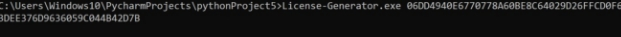

the License is created in the file License.dat.

Now, we will run the Python code to generate a protected version of the software. There are two Python scripts, one for the 64-bit version and one for the 32-bit version. In this tutorial, we will use the 32-bit version. 

For example, if we want to create a protected version of SoftwareToDemonstrate.exe:

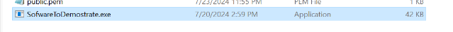

this software contains a simple snake game. 

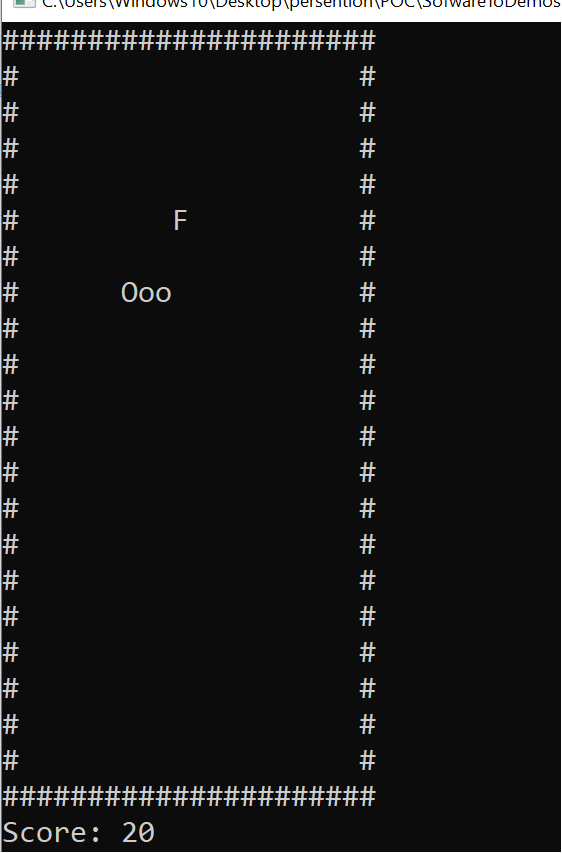

To create a protected version of this game, we should run the Protected\_Software\_Generator\_32bits.py script in the same directory as the exe file we want to protect. License.dat, Activation_Program.exe (in the right version), and public.pem (if the server wants to send this to the client as well) should be in the same directory as the Python code. 

Now run the Python script with the name of the file we want to protect. 

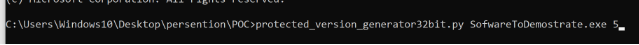

Here, we will run the Python script with the exe file we want to protect and with a limit factor of 5, which is the minimum number of bytes in a block we will encrypt. The default value of this parameter is 10.

After running the Python script, the out folder will be created. 

The out directory will be sent to the client. 

**Client Side:**

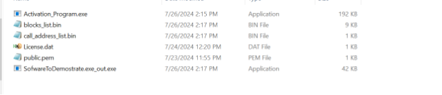

This is what the server sends to the client. To activate the SoftwareToDemonstrate.exe\_out.exe file, the client will need to run the Activation\_Program.exe file with all the files in the out directory. 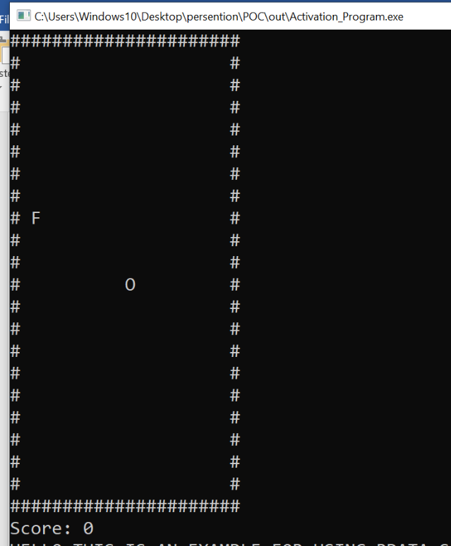

It's important to note that this will only work on the computer that provided its PC ID to the server. 

**Summary**

**Client Side:**

Step1: Get the client PC IDs and send them to the server.

**Server Side:**

Step2: Generate the client's license using the PC ID received and run the License\_Generator.exe file.

Step3: Ensure the Activation\_Program.exe file with the correct version is in the directory.

Step4: Generate the protected software by running the protected\_version\_generator32bit.py or protected\_version\_generator64bit.py script with the exe file name you want to protect.

Step5: Send the out directory to the client.

**Client Side:**

Step6: Run the software using Activation\_Program.exe.

GIT:	<https://github.com/yosef147yosef/License-Generator-PC-IDs-based-verification>
# Introduction:

Today we are addressing one of the most pressing challenges of our digital age: protecting our valuable software and digital content from unauthorized use. In a world where cyber warfare and relentless hacking attempts are the norm, safeguarding your software against unauthorized access has never been more critical.

A recent survey revealed that 60% of consumers admitted to having streamed or downloaded content illegally. Even more striking is that 83% of these individuals tried to find legal avenues before resorting to piracy. And it doesn't stop there. Bournemouth University estimated that TV companies in Europe

lost €3.21 billion in 2021 due to illegal streaming sites. Illegal providers made €1.06 billion from Europe alone in the same year.

- Impact of Revenue Loss: Piracy causes billions in annual losses for the music, film, and video game industries, with recorded music revenues falling by 50% between 1999 and 2009 due to illegal file sharing.
- Impact on Jobs and the Local Economy: Revenue losses from piracy lead to staff reductions and reduced investment in new products, negatively impacting local economies.
- Reduction of Innovation: Decreased revenue from piracy results in less investment in research and development, slowing technological progress and innovation.
- Costs of Fighting Piracy: Significant funds are spent on DRM technologies, legal actions, and cybersecurity, costs that are often transferred to consumers through higher prices.
- Security Risks: Pirated software is often altered to include malware, posing serious security risks and additional costs for companies.
- Increased Risk with Video Consumption: The rise in digital video viewers from 2.6 billion in 2019 to a projected 3.1 billion in 2023 heightens the risk of piracy, threatening revenue through easy distribution.

Imagine a world where your programs are secure, where your revenue is protected, and where your innovation is not stifled by piracy. Today, we are introducing a revolutionary solution designed to make this vision a reality.

# Product Overview

The product contains two main parts, server program and activation system.

The server system should be installed on the server machine. And needs to be activate with the path to the software you want to protect for each new license you want. The license will get from the user his identifier, and will create protected version of the software, the license, and some supporting files.

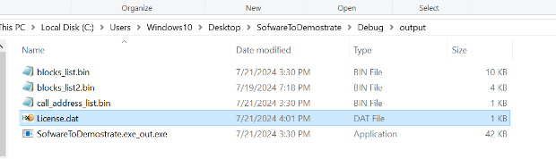

The server will send all of those to the client, along with the activation file. The client will use the protected version only with the activation system.

- The protected program runs only on the machine to which it had been created for (even if the license is being shared).
- It is impossible to activate the protected software without the license and the activation program.
- it’s very hard for reverse engineering, and thus, all the intellectual properties are protected.
- Easy portable and ensure simple use.

## Target Market

Software Companies and Developers: form a significant portion of the target market for DRM systems. They use DRM to protect their intellectual property and prevent unauthorized use or distribution of their software.

Enterprise Software Providers: especially those offering high-value applications such as CAD software, financial tools, and data analysis platforms, are key targets for DRM solutions.

Video Game Industry: including both PC and console games, is a major user of DRM systems to prevent piracy, protect game assets and Security examines DRM techniques in the gaming industry [3].

Educational Software Providers: Educational institutions and e-learning platforms use DRM to protect course materials and manage access to educational software.

The global Digital Rights Management (DRM) market, which includes software protection, is experiencing significant growth. According to a report by MarketsandMarkets, the DRM market is expected to grow from $3.5 billion in 2020 to $6.1 billion by 2025, at a Compound Annual Growth Rate (CAGR) of 11.8% [1].

A more recent report by Grand View Research estimates that the global DRM market size was valued at

$3.69 billion in 2021 and is expected to expand at a CAGR of 15.1% from 2022 to 2030 [2].

## Business Requirements

The purpose of our DRM system is to provide robust protection for software assets, preventing unauthorized use, distribution, and modification while ensuring a seamless experience for legitimate users. This aligns with our business objective of safeguarding intellectual property and maintaining revenue streams from software sales and licensing.

Our objectives are to:

- Increase software revenue by reducing piracy rates by at least 30% within the first year of the publishment.
- Enhance customer trust by providing a secure, tamper-resistant software environment.
- Enable flexible licensing models (e.g., subscription-based, pay-per-use) to adapt to evolving market demands and increase recurring revenue by 25%.
- Reduce support costs related to license management by 40% through automation and self- service capabilities.
- Achieve compliance with industry standards and regulations (e.g., GDPR, CCPA) to expand market reach.
- Increase software usage analytics capabilities to inform product development and marketing strategies.
- Maintain software performance, ensuring that DRM implementation does not increase load times by more than 5%.
- Achieve a customer satisfaction rate of at least 85% regarding the licensing and activation process.
## Constraints

Budget**:** The development team currently consists of only two workers. To build a strong development team, we need at least 50 workers, along with offices and equipment. The estimated cost is at least 15 million shekels, with options for additional funding.

Compatibility: The system must be compatible with major operating systems (Windows, macOS, Linux) and support both desktop and mobile applications.

Performance: The DRM solution must not increase application startup time by more than 2 seconds.

## Assumptions

- The current infrastructure can support the additional load from DRM processes without significant upgrades.
- Users will have a consistent internet connection for initial activation and periodic license verification.
- The legal framework for software protection will remain stable in our key markets over the next three years.
- Our software partners and distributors will be willing to integrate our DRM solution into their products and platforms.
- The development team has the necessary expertise to implement advanced cryptographic techniques required for robust DRM.
- Users will accept the DRM system if it provides a seamless experience and clear value proposition.
- The benefits of reduced piracy will outweigh any potential loss of users who refuse to use software with DRM.

## Functional requirements:

To implement this system effectively, we first need to identify a robust PC ID to serve as the foundation for the license generator. Additionally, we will establish a validation mechanism for the program through a dedicated License Server, integrate advanced packing techniques, and conduct thorough testing to ensure the system's resilience.

Find good PC ID: Find unique and universal and permanent machine’s attribute to activate as computer identifier. The attribute should be hard to temper or to steal. The pc id must be easily accessible.

License Generator system: Develop a robust license generator capable of receiving PC ID as input and generating a unique license for each machine.

License validation: Implement a system to validate license. The license will be valid only on the machine to which it was given to.

Resistance to bypassing and patching: Find a way to protect our system. Demonstration and Testing: Be the hacker to think how to break our system.

Ease of Portability and Integration: Design the system in a modular and portable manner to facilitate easy integration into other projects. The system should get the path of exe file and create license file and new lock exe file for each PC ID.

## High Level Security Objectives:

Ensure Confidentiality and Prevent Unauthorized Modification: Ensuring the confidentiality of customer data and preventing unauthorized modification by unprivileged software adversaries is a key security objective. This will involve implementing robust encryption mechanisms to protect sensitive data and adopting strict access controls to limit data access only to authorized users.

Secure Authentication Mechanisms: Implement robust authentication mechanisms to verify the identity of users accessing the software, ensuring that only authorized individuals can use the program.

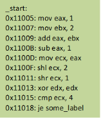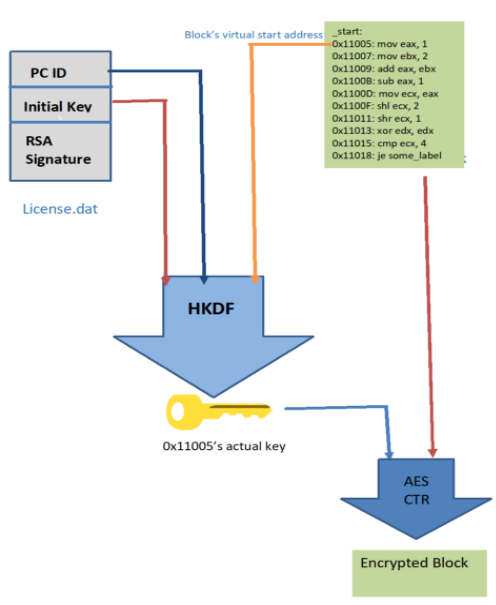

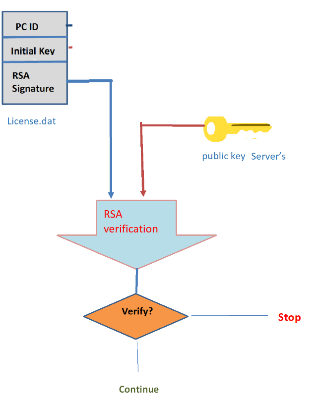
#
# Implementation and Development Process

## License Generator	

The license is generated as a binary file containing the following elements:

1. PC ID: 32 bytes
1. Initial Key: 16 bytes
1. Generation Time: sizeof(time\_t) bytes (architecture-dependent, either 32 or 64 bits)
1. RSA Digital Signature: 64 bytes

It's important to note that although these sizes are used in the current version, they may change in future versions.

### License Components

PC ID: Composition and Usage

The PC ID serves as a unique identifier for the client machine [16]. It is generated using a combination of hardware characteristics to ensure that the license is bound to a specific device.

The main PC IDs include:

0. MAC Address: Unique identifier for the network interface card [17].
0. Disk UUID: Universally unique identifier for each disk [18].
0. Volume Serial Number: Unique number assigned to a disk volume [19].
0. Processor ID: Unique identifier for the CPU [20].
0. Motherboard ID: Unique identifier for the motherboard.

Using PC IDs enhances security by ensuring that only authorized devices can access the software, adding an extra layer of protection against unauthorized use [21]. By linking the software to specific hardware, it becomes significantly harder for pirates to distribute and use the software illegally [22]. Additionally, PC IDs allow for precise identification of individual machines within a network, facilitating better management and monitoring [23].

The selection criteria for a DRM system include uniqueness, stability, difficulty of modification, and resistance to spoofing.

0. Uniqueness: Each DRM license should be unique to prevent duplication and ensure that each instance is tied to a specific user or device [24].
0. Stability: The DRM system must be stable, ensuring consistent performance and reliability over time.
0. `	`Difficulty of modification: The DRM should be resistant to tampering, making it difficult for unauthorized users to alter or bypass the system [25].
0. Resistance to spoofing: The system should be designed to detect and prevent attempts to fake or spoof identities, ensuring robust security [26].

Secure DRM license generation involves combining multiple PC IDs to increase complexity for piracy, minimize collision risk, and provide redundancy in case one identifier is compromised.

0. Increasing complexity for piracy: Combining multiple PC IDs makes it harder for pirates to crack the DRM, as it increases the complexity of the security measures [27].
0. Minimizing collision risk (two machines having the same identifiers): Using multiple identifiers reduces the risk of two machines having the same ID, ensuring that licenses are unique and secure [28].
0. Providing redundancy in case one identifier is compromised: Multiple identifiers offer a backup, so if one is compromised, the others can still provide security, maintaining the integrity of the DRM system [29].

The security process involves concatenating different PC IDs and applying cryptographic techniques to the combined identifiers [30] to enhance protection against unauthorized access and ensure data integrity.

A weakness of using PC IDs is that they are relatively easy to find if someone has physical access to the computer [31].

Initial Key

The key is the cornerstone of the license, used for encrypting and decrypting protected data. Various approaches exist for key generation, with an ideal algorithm producing unique keys without collisions [4]. However, implementing such an ideal system would require maintaining an extensive database and constant validation to prevent key repetition. This approach presents challenges:

0. It demands significant server resources.
0. It limits the total number of possible licenses to 8^(key size).
0. An ideal key generator that is entirely unpredictable is theoretically impossible to achieve.

In practice, an ideal key generator is unattainable. Our approach to minimizing collisions involves using the PC ID and generation time as seeds for a pseudorandom function [5]. This method operates under two assumptions:

0. Each user has a unique PC ID.
0. The pseudorandom function behaves similarly to a true random function.

Under these conditions, the probability of key collisions is approximately 1 in 2^256, which we consider sufficient for most applications.

For pseudorandom number generation, we use the RAND\_seed and RAND\_bytes functions from the OpenSSL library [6]. This approach offers an additional advantage: it potentially allows for key recovery in case of issues without compromising the key itself. While this feature is not implemented in the current version, it remains a consideration for future enhancements.

Generation Time

The generation time is recorded to assist in reducing key collisions and can be used to implement license expiration features. Also, this argument make the license that being generated different in each generation, making it harder to predict. This value is obtained using the time(NULL) function from the ctime library.

RSA Digital Signature

The RSA digital signature serves multiple purposes within the license [7]:

Signing the License:

0. When creating a license file, the provider calculates a hash (a fixed-size representation) of the license data.
0. This hash is then encrypted with the provider's private key, creating the signature.
0. The signature is attached to the license file.

Verification:

0. When the software verifies the license, it first calculates the hash of the license data.
0. It then uses the provider's public key to decrypt the signature and reveal the original hash.
0. If the calculated hash matches the decrypted hash, the license is verified as authentic and unmodified.

1. Authenticity: It provides proof that the license file was generated by a legitimate source. The signature, created with a private RSA key, can be verified using the corresponding public key.
1. Integrity: The signature ensures that the license file contents have not been altered. Any modification to the file after signing will cause the signature verification to fail.
1. Non-repudiation: The use of RSA signatures prevents the signing entity from denying the issuance of the license, which is crucial for legal and administrative purposes.

The server signs the license using its private key, and the client-side validation system verifies the license, rejecting any invalid licenses. In the current implementation, RSA-512 is used with SHA-256 as the hash function.

Program Encryption

To protect the software from unauthorized use and reverse engineering, we employ a block-based encryption scheme for the program's executable file. This approach offers superior protection compared to simple conditional checks that can be easily bypassed.

Basic Block Encryption

Instead of encrypting the entire file as a single unit, which could make it vulnerable to complete decryption if the key is compromised, we divide the text section (containing the actual code) into multiple basic blocks [8]. A basic block is a sequence of consecutive assembly or machine instructions with the following properties:

1. A Single-entry point
1. A Single exit point
1. No internal jumps or branches
1. A Sequential execution without interruption

Example of Dividing Code into Basic Blocks

*Consider this assembly code:* 

mov eax, 1	; Instruction 1

add eax, 2	; Instruction 2 jmp label1	; Jump to label1

label1:

mov ebx, 3	; Instruction 3 cmp ebx, eax		; Instruction 4

je label2	; Jump to label2 if ebx == eax

label2:

sub eax, 1	; Instruction 5

*Basic Blocks:* 

1. Block 1:

   mov eax, 1

   add eax, 2 jmp label1

1. Block 2:

   label1: mov ebx, 3

   cmp ebx, eax je label2

1. Block 3:

   label2:

   sub eax, 1

Each basic block is encrypted separately, ensuring that decryption occurs only when execution enters a new block. This approach makes it significantly more challenging for unauthorized users to decrypt and analyze the entire program.

Challenges and Solutions

Dividing the program into basic blocks presents some challenges:

Dynamic jumping: In cases where the program jumps to an address stored in a register, it may enter the middle of an encrypted block. To address this, we preserve all locations containing dynamic jumps and handle them separately within the debugger.

Non-instruction bytes: The disassembler may not always correctly identify non-instruction bytes in the text section, potentially breaking the block usage. We mitigate this issue by filtering blocks that contain fewer instructions than addresses, particularly in the context of switch-case address tables.

Block size optimization: The number of blocks to encrypt is determined by a limit factor, which filters out blocks smaller than a specified number of bytes. This factor can be adjusted to balance security and performance.

HKDF (HMAC-based Key Derivation Function)

The HKDF process is used to derive unique encryption keys for each block of the program from the initial key generated in the license [9]. This two-step process ensures that even if the initial key is compromised, the individual block keys remain secure, and of course, encrypting with different key each block will be far more hard to decrypt. And the most important Creates bound between certain block, initial key (the license), certain machine. Changing one of those three will create different key, and thus will not be able to decrypt any block correctly.   

The Algorithm base on HMAC algorithm. It’s an algorithm that get fixed size key and message and creates pseudorandom fixed size byte string base on the key, the message and hash function. In out implementation we chose sha256 as the hash function. 

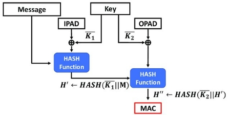

Here’s the code for the HMAC in python. 

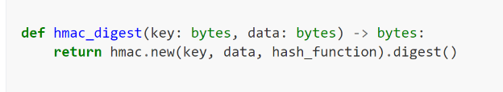

The HKDF contains two steps, each one uses the hmac algorithm:

Extract step: This step produces a pseudorandom key (PRK) from the input key material (IKM) and a salt. In our implementation, the IKM is the initial key from the license, and the salt is the start virtual address of the block. 

Here’s the python code for this part: 

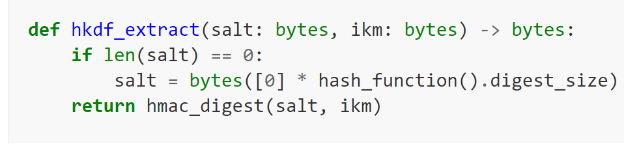

Expand step: This step expands the PRK into output key material (OKM) of the required length, incorporating additional context-specific information (info argument). In our case, this will be the machine’s PC [10] (this will be generated ounce in the machine itself (not taking it from the license, so the code will work only on one machine, the one that the license was generated for)).

Here’s the python code of this part: 

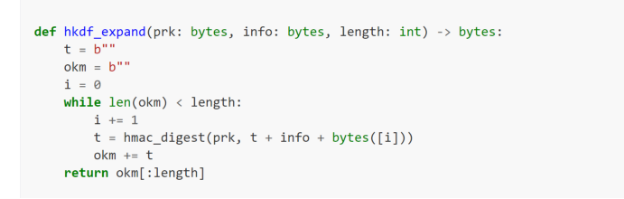

Here’s the python code of the combined HKDF

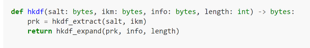

Our implementation of HKDF uses the following parameters:

1\.Salt: We use the block address (converted to 4 bytes or 8 bytes) as the salt. This ensures that each block has a unique salt, even if the other parameters are the same.

2\.Input Key Material (IKM): The initial key (key\_bytes) from the license serves as the IKM. This is the secret key material from which we derive the block-specific keys.

3\.Info: The PC ID is used as the info parameter. This adds an extra layer of context-specific information to the key derivation process, binding the derived keys to the specific machine. The most important role this parameter serves is to bind the decryption process into specific machine. This value is generated ounce the program starts (not taking it from the license). So that if the program will run on another computer it will change the whole keys (since this parameter will be different)

Output Length: We set this to AES\_KEY\_LENGTH to ensure the derived key is the correct size for our encryption algorithm.

The use of HKDF provides several benefits:

- It generates unique keys for each block, enhancing security.
- It allows for deterministic key generation, eliminating the need to store individual block keys.
- It provides cryptographic separation between the initial key and the block-specific keys.
- Creates bound between certain block, initial key (the license), certain machine. Changing one of those three will create different key, and thus will not be able to decrypt any block correctly.   

Encryption Method: AES-128 CTR Mode

We use AES-128 in Counter (CTR) mode for encrypting the blocks. CTR mode is chosen for several reasons [1] [11]:

- It doesn't require padding, making it suitable for encrypting blocks of various sizes.
- It allows for parallel encryption and decryption, potentially improving performance.
- It turns the block cipher into a stream cipher, enabling the encryption of data of any length without the need for padding.

In CTR mode, a counter is encrypted and then XORed with the plaintext to produce the ciphertext. This counter is incremented for each block, ensuring that each block is encrypted with a unique keystream [12].

The key will be HKDF algorithm result. 

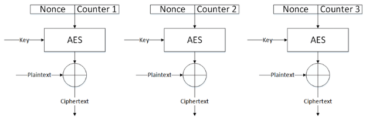

Angr Package and Its Use in the Project

Angr is a powerful binary analysis framework that provides a suite of tools for analyzing, reverse engineering, and exploiting binary programs [13]. In our project, we used Angr for several key purposes:

Control Flow Graph (CFG) Generation: We use Angr to create a CFG of the target binary, which helps us identify basic blocks and their relationships. The angr CGF is not divide blocks by jumping target address. it was added by our implementation.

Basic Block Analysis: Angr allows us to analyze individual basic blocks, including their instructions and properties, which is crucial for our block-based encryption scheme.

Problem we faced during the dividing the blocks was non instruction bytes in the text section. That was making the program entering the middle of the block. And reading of this encrypted info. Angr know how to detect non instructions bytes, but it’s not perfect. The problem was loaded when we protected software that uses switch case. In switch cases, smart compiler uses an address table instead of a chain of conditional jumps. To mitigate this problem, we filter blocks where the number of addresses is greater than the number of instructions (under the assumption it is usually will be address). but handling non-instruction bytes in the text section relies heavily on the Angr module for detection.

The use of Angr significantly simplifies the process of binary analysis and manipulation, allowing us to implement our DRM system more efficiently and effectively [14].

Summary of the License Generation Server Side The license generator contains (on the server side):

The exe file license generator (written in C) generates the actual license. Output: Binary file containing license fields with digital signature.

Encryption program - encryption of the input exe file and creation of helping file for the activation program.

Output:

1. Encrypted exe file.
1. Block ranges binary file
1. Dynamic jumps address binary file

The encrypted exe file is sent to the user as the protected system. The binary files and the license are sent with the activation exe file.

Activation Program

The activation program is responsible for activating the protected program. Without the activation program, the protected program is useless. To create the activation program, we developed a debugger to activate the protected exe file [15]. The program first reads the block ranges file and adds a breakpoint instruction (int3 or 0xcc) as the first instruction of each block. Due to the single-entry point of the block, the breakpoint provides an opportunity to decrypt the entire block.

A few challenges we faced during this process include:

1. Reallocation addresses in the middle of the block: Since E(address + base address) ≠ E(address) + base address, the addresses in the block aren't the original ones.

   Solution: At the start, we read all the reallocation addresses from the reallocation address (PE format field). After that, for each block, we check if there are addresses that are reallocated in the block. For each address, we subtract the base address from it, decrypt it, and add the base address again.

1. Dynamic jumps: As described above, dynamic jumps can jump to the middle of a basic block, which means the debugger wouldn't see the breakpoint and would think it's reading the actual instructions when in fact it's reading only the encrypted ones.

   Solution: The activation program gets dynamic jump addresses in the binary file. The program will put a breakpoint for each non-encrypted call address instruction. When a breakpoint debug event occurs, It will check if the breakpoint address is in the dynamic jump address list, and if so, single-step mode will be set. This means a debug event will happen after the current instruction. If the instruction is encrypted (inside one of the encrypted basic blocks), after decrypting, the program will put the breakpoint on the dynamic jump instruction.

When the debugger detects single-step mode, it will check if the jump was to the middle of an encrypted basic block, and if so, it will ensure to decrypt it.

The reason that single-step mode was not set for all the instructions in the code is that it would significantly impact performance. The number of dynamic jumps into the text section is significantly smaller than the number of instructions, so using this solution for such cases is tolerable.

# Security Context

Our system consists of five main components:

1. Protected (encrypted) software - unique for each user
1. Activation program - identical for all users
1. License file - unique for each user
1. Block ranges file - identical for all users
1. Dynamic jump file - identical for all users

The encryption of each basic block is implemented on the server side, making it inaccessible to regular users. Attempting to crack the software without knowing the exact implementation of block division and encryption is virtually impossible. However, if this information were to leak, a potential cracker could attempt the following:

1. Cracking the software using only the protected version is nearly impossible. The cracker would need to obtain the block ranges file to determine which key is used for each block.

1. To crack the software using both the activation program and protected software, the cracker would need to: a) Obtain the block ranges file b) Reverse engineer the activation program to find the HKDF algorithm implementation c) Somehow acquire the AES key and the PC ID for which the protected version was generated Both the AES key and PC ID would require brute force attempts unless shared by a legitimate user. In our implementation, the PC ID is 32 bytes long, and the key is 16 bytes long, resulting in 8^(48) possibilities.

3\.

1. If a cracker obtains all components from a paying customer, they will need to: a) Extract the PC ID from the license b) Reverse engineer the activation file to understand the HKDF implementation c) Generate keys for each basic block The cracker could also debug the program to view plaintext data after decryption. This process would be time-consuming and challenging to automate, requiring significant effort and expertise.

1. A cracker can also modify the activation program to get the pc id from the license instead of getting it from the activated machine. This will require reverse engineering of the activation program and patching it. This is the easiest way to crack our system. And it requires buy license, reverse engineering of the activation program (which will take time to the normal hacker). Also, to distribute this cracked program they will have to publish the pc id that cracked the software, which can potentially lead to legal action or blacklisting some PC IDs (maybe in the next version)
1. A sophisticated cracker can create program such as the activation program, but without the debbuger, and decrypting and saving the protected software to his hard disk.  

Generally, the weak point is it activation program.

Protection against Man-in-the-Middle (MITM) attacks relies on the server using secure transport protocols.

# Future Work and Improvements

- Protecting the server-side encryption algorithm using our own servers will significantly reduce the risk of server-side code leakage. It will also allow us to be a trusted entity for signing signatures. Additionally, we can mitigate Man-in-the-Middle (MITM) attacks by implementing our own secure connections.

- Adding expiry dates to licenses can greatly enhance business utility.

- Blacklisting certain PC IDs ensures that PCs with untrusted software (as described in security context 3.2) will be blocked in future versions. This ensures that only paying users can access new versions of protected software.

- Encrypting other sections: Sometimes critical information resides in the data or rdata section of the exe file. Encrypting these sections can play a crucial role in safeguarding software properties.

- Other OS compatibility: Currently, our system supports only Windows 10 operating systems.

- Processor support: Our system currently supports only Intel x86/64 architectures.

- Supporting multithreaded programs.

- Enhancing performance.

- More continent user interface. 

- Obscuration of the activation program.   

# Footnotes:

`  `[1] Chapter 1: Liu, Q., Safavi-Naini, R., & Sheppard, N. P. (2003). Digital rights management for content distribution. (modified)

4. Chapter 3.2: Menezes, A. J., Van Oorschot, P. C., & Vanstone, S. A. (1996). Handbook of applied cryptography. CRC press. (Good)

4. Chapter 3.2: Eastlake 3rd, D., Schiller, J., & Crocker, S. (2005). Randomness requirements for security (RFC 4086). Internet Engineering Task Force (IETF). (Good, some externals inputs)

4. https://[www.openssl.org/](http://www.openssl.org/)

4. A DRM framework towards preventing digital piracy - Conference Paper · December 201 - DOI: 10.1109/ISIAS.2011.6122785 · Source: DBLP - CMR Technical Campus - 123 PUBLICATIONS 1,959 CITATIONS -- & -- Digital rights management: The technology behind the hype.

4. Chapter 4.1: Aho, A. V., Lam, M. S., Sethi, R., & Ullman, J. D. (2006). Compilers: Principles, Techniques, and Tools (2nd Edition). Addison Wesley.

4. Chapter 4.3: Krawczyk, H., & Eronen, P. (2010). HMAC-based Extract-and-Expand Key Derivation Function (HKDF) (RFC 5869). Internet Engineering Task Force (IETF).

4. Chapter 4.3: Krawczyk H, Eronen P (2010) HMAC-based Extract-and-Expand Key Derivation Function (HKDF). (Internet Engineering Task Force (IETF)), IETF Request for Comments (RFC) 5869. <https://doi.org/10.17487/RFC5869>

4. Chapter 5: Dworkin, M. (2001). Recommendation for block cipher modes of operation: Methods and techniques (NIST Special Publication 800-38A). National Institute of Standards and Technology

4. Chapter 5: Ferguson, N., Schneier, B., & Kohno, T. (2010). Cryptography engineering: design principles and practical applications. John Wiley & Sons.

4. Chapter 6: Shoshitaishvili, Y., Wang, R., Salls, C., Stephens, N., Polino, M., Dutcher, A., ... & Vigna, G. (2016, May). Sok:(state of) the art of war: Offensive techniques in binary analysis. In 2016 IEEE Symposium on Security and Privacy (SP) (pp. 138-157). IEEE. =

4. <https://angr.io/>

4. <https://www.timdbg.com/>

4. Microsoft Corporation. "Partitions and Volumes". Retrieved 2014-06-10.
4. IEEE Standards Association. "Guidelines for Use of Extended Unique Identifier (EUI), Organizationally Unique Identifier (OUI), and Company ID (CID)" (PDF). Retrieved 5 August 2018.
4. Davis, K.; Peabody, B.; Leach, P. (2024). "Universally Unique IDentifiers (UUIDs)". Internet Engineering Task Force. doi:10.17487/RFC9562. RFC 9562. Retrieved 9 May 2024.
4. Microsoft Corporation. "Partitions and Volumes". Retrieved 2014-06-10.
4. Intel. "Intel® Processor Identification and the CPUID Instruction" (PDF). May 2002, archived from the original on 2021-04-17.
4. Arul Lawrence Selvakumar. "The Evaluation Report of SHA-256 Crypt Analysis Hash Function". IEEE Xplore. <https://ieeexplore.ieee.org/abstract/document/5076920>
4. National Institute of Standards and Technology (NIST). "Secure Hash Standard (SHS)". FIPS PUB 180-4. August 2015.
4. Encryption Consulting. "SHA-256: Secure Hash Algorithm". <https://www.encryptionconsulting.com/education-center/sha-256/>
4. Techopedia. "SHA-256". <https://www.techopedia.com/definition/sha-256>
4. Cheap SSL Web. "SHA1 vs SHA256". <https://cheapsslweb.com/blog/sha1-vs-sha256/>
4. National Institute of Standards and Technology (NIST). "Secure Hash Standard (SHS)". FIPS PUB 180-4. August 2015.
4. Arul Lawrence Selvakumar. "The Evaluation Report of SHA-256 Crypt Analysis Hash Function". IEEE Xplore. <https://ieeexplore.ieee.org/abstract/document/5076920>
4. Davis, K.; Peabody, B.; Leach, P. (2024). "Universally Unique IDentifiers (UUIDs)". Internet Engineering Task Force. doi:10.17487/RFC9562. RFC 9562. Retrieved 9 May 2024.
4. Encryption Consulting. "SHA-256: Secure Hash Algorithm". <https://www.encryptionconsulting.com/education-center/sha-256/>
4. National Institute of Standards and Technology (NIST). "Secure Hash Standard (SHS)". FIPS PUB 180-4. August 2015.
4. Cheap SSL Web. "SHA1 vs SHA256". <https://cheapsslweb.com/blog/sha1-vs-sha256/>
